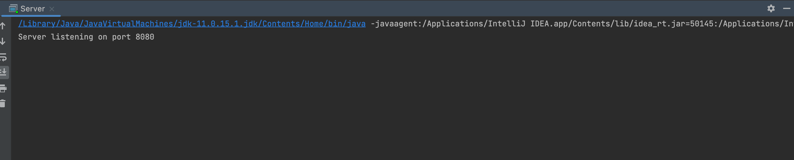
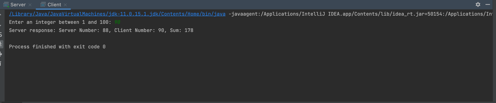
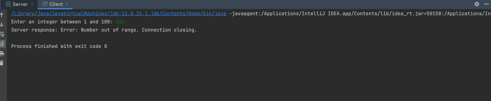

1. Description: This is a Java application that creates TCP communication between a client and a server.
The client sends a message containing a user's name and an integer to the server. The server responds with its name,
a randomly selected integer, and the sum of the two integers.

2. User Guide:
 a. Build the project using command "mvn build"
 b. Run the server.
 c. Run the client.

3. Choice of language: Java.

4. Program design: The client program initiates a TCP connection, sending a structured message to the server.
The server listens on a predefined port, accepting connections and spawning a new thread for each client.

5.

6. Source Code:"
package org.example;
import java.io.*;
import java.net.*;

public class Client {
    public static void main(String[] args) {
        String serverName = "localhost";
        int port = 8080;

        try (Socket clientSocket = new Socket(serverName, port);
             PrintWriter out = new PrintWriter(clientSocket.getOutputStream(), true);
             BufferedReader in = new BufferedReader(new InputStreamReader(clientSocket.getInputStream()));
             BufferedReader stdIn = new BufferedReader(new InputStreamReader(System.in))) {

            System.out.print("Enter an integer between 1 and 100: ");
            String number = stdIn.readLine();
            String message = "Client of Sifan Wei, " + number;

            out.println(message);

            String response = in.readLine();
            System.out.println("Server response: " + response);

        } catch (IOException e) {
            e.printStackTrace();
        }
    }
}"

"package org.example;

 import java.io.*;
 import java.net.*;
 import java.util.Random;

 public class Server {
     public static void main(String[] args) {
         int port = 8080;

         try (ServerSocket serverSocket = new ServerSocket(port)) {
             System.out.println("Server listening on port " + port);

             while (true) {
                 new ClientHandler(serverSocket.accept()).start();
             }
         } catch (IOException e) {
             e.printStackTrace();
         }
     }

     private static class ClientHandler extends Thread {
         private Socket clientSocket;

         public ClientHandler(Socket socket) {
             this.clientSocket = socket;
         }

         public void run() {
             try (PrintWriter out = new PrintWriter(clientSocket.getOutputStream(), true);
                  BufferedReader in = new BufferedReader(new InputStreamReader(clientSocket.getInputStream()))) {

                 String inputLine;
                 while ((inputLine = in.readLine()) != null) {
                     String[] parts = inputLine.split(", "); // Split by ", " to separate the name and the number
                     if (parts.length < 2) {
                         out.println("Error: Invalid input format. Expected name and number.");
                         break;
                     }
                     try {
                         int clientNumber = Integer.parseInt(parts[1].trim());
                         if (clientNumber < 1 || clientNumber > 100) {
                             out.println("Error: Number out of range. Connection closing.");
                             break;
                         }
                         int serverNumber = new Random().nextInt(100) + 1;
                         out.println("Server Number: " + serverNumber + ", Client Number: " + clientNumber + ", Sum: " + (clientNumber + serverNumber));
                     } catch (NumberFormatException e) {
                         out.println("Error: Invalid input. Please enter an integer.");
                     }
                 }
                 clientSocket.close();
             } catch (IOException e) {
                 e.printStackTrace();
             }
         }
     }
 }"

